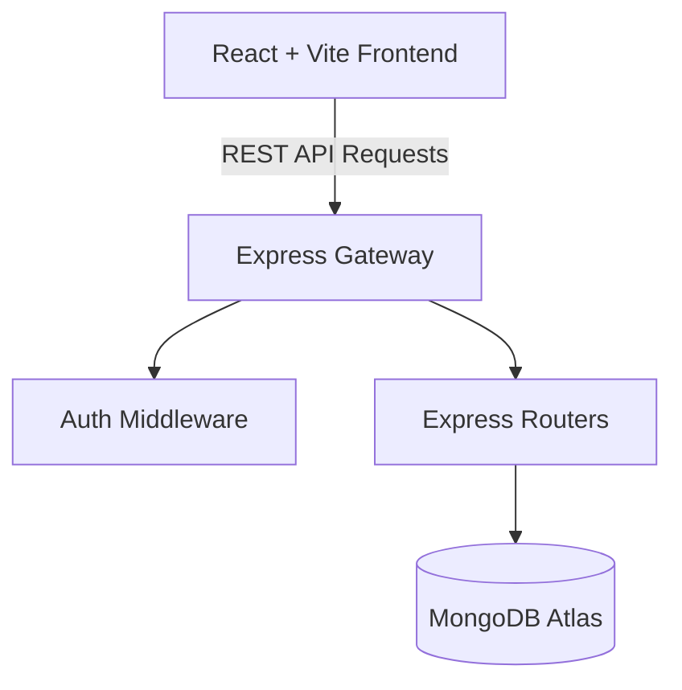

# PlaceX - Candidate Telemetry & Placement Tracking System
## Project Documentation & Functional Specification

PlaceX (deployed at `mytrackinginterview.vercel.app`) is a comprehensive MERN-stack platform built to manage and monitor candidate tracking, daily activities, attendance, mock interviews, task assignments, and corporate placements. It supports distinct role workflows for **Students**, **Coordinators**, **Placement Officers**, and **Administrators**.

---

## 1. System Architecture

The project is structured as a monorepo consisting of:
*   **`client/`**: A modern React application powered by Vite, utilizing Tailwind CSS and Vanilla CSS utility classes for styling, and Lucide React for iconography.
*   **`server/`**: A Node.js backend using Express and ES Modules (`import/export`), communicating with a MongoDB Atlas cluster via Mongoose.



---

## 2. Role-Based Permission Model

The platform segregates workflows using four core roles:

| Role | Access Level / Responsibilities | Key Pages / Views |
| :--- | :--- | :--- |
| **Admin** | Full system control. Manages all student lists, overrides grading, assigns tasks, updates settings, and monitors telemetry. | `/admin/frontend-students`, `/admin/spl-classes`, `/tasks`, `/settings` |
| **Coordinator** | Observes student details, manages class registrations, updates rosters, and takes daily attendance. | `/coordinator/dashboard`, `/attendance` |
| **Placement** | Tracks candidate placement readiness, logs corporate entities, package LPAs, and exports eligible candidate reports. | `/placement/eligibility`, `/placement/spl-classes` |
| **Student** | Records daily activities, submits leave requests, schedules mock interviews, and updates progress on assigned task questions. | `/student/dashboard`, `/student/tasks`, `/student/activity` |

---

## 3. Database Models & Schema Specifications

The backend operates on nine primary mongoose schemas:

### A. User Schema (`User.js`)
Handles authentication credentials and matches roles.
*   `email` (String, unique, lowercase, trimmed) - Primary login handle (can be a student email or mobile number).
*   `password` (String) - Encrypted using `bcryptjs` (salt factor 10).
*   `name` (String) - Display name.
*   `role` (String) - Enums: `['admin', 'student', 'coordinator', 'placement']`.
*   `studentId` (ObjectId) - References `Student` or `SplRegistration` (null for admins/staff).

### B. Student Schema (`Student.js`)
Tracks the master roster of regular and frontend candidates.
*   `name` (String, required)
*   `mobile` (String, required, indexed)
*   `email` (String, indexed)
*   `degree` (String)
*   `batch` (String)
*   `passedOutYear` (String)
*   `city` (String)
*   `grade` (String) - Enums: `['A', 'B', 'C', '']`
*   `stack` (String) - Tech track, e.g. `['MERN Stack', 'Java Full Stack', 'Python Full Stack']`
*   `studentType` (String) - Enums: `['Regular', 'Frontend', 'SPL']`
*   `currentStatus` (String) - Enums: `['Job Seeker', 'Placed', 'Need to filled', 'Inactive/Suspend']`
*   `statusReason` (String) - Notes detailing suspension/inactivity reason.
*   `companyName` / `packageLpa` / `jobGetMode` - Placement telemetry fields.

### C. Task & Question Schema (`Task.js`)
Manages assignments distributed by administrators.
*   `studentId` (ObjectId, ref: 'User')
*   `studentName` / `studentEmail` (Strings)
*   `title` (String) / `description` (String)
*   `overallStatus` (String) - Combined progress status: `['Pending', 'In Progress', 'Completed', 'Blocked', 'Review']`
*   `questions` - Array of individual questions containing:
    *   `question` (String)
    *   `status` (String) - Status of the individual question.
    *   `remarks` (String) - Submission links or blocker reasons.

### D. Attendance Schema (`Attendance.js`)
Tracks daily logins and status.
*   `studentId` (ObjectId, ref: 'Student')
*   `date` (Date, indexed)
*   `status` (String) - Enums: `['Present', 'Absent', 'Leave']`

### E. DailyActivity Schema (`DailyActivity.js`)
Tracks student progress logs.
*   `studentId` (ObjectId)
*   `date` (Date)
*   `companyApply` (String) - Companies applied to today.
*   `taskWorkProcess` (String) - Log text describing daily progress.

---

## 4. Key Functional Workflows

### 1. Student Tasks & Question Tracking
*   Students navigate to `/student/tasks` to view assignments sorted by date.
*   **Question Renders**: Individual questions display inside clean `rounded-xl` borders with a left-aligned numeric index badge (`1`, `2`, `3`), matching the administrator's preview.
*   **Update Flow**: Students can toggle each question's status and insert links (e.g. GitHub repos) or blocker details. The overall task status dynamically updates (e.g. shifts to "Completed" if all individual questions are marked "Completed").

### 2. Candidate Search
*   Instant search filters tables in real-time as users type.
*   Pressing **Enter** bypasses typing debounce limits to execute database queries instantly.
*   Typing queries resets pagination to page `1` automatically, preventing empty result grids.

### 3. Dynamic Column Toggles
*   Roster tables feature a column dropdown trigger allowing coordinators and placement staff to show or hide fields (Degree, Location, Grade, Tech Stack) dynamically.

---

## 5. Primary API Endpoint Map

All routes are prefixed with `/api`. Access headers require `Authorization: Bearer <JWT_TOKEN>`.

### Auth & User Actions (`/api/auth`)
*   `POST /login` - Validates credentials, executes automated student account checks, and generates a JWT.
*   `GET /me` - Returns active profile and authorization details.
*   `POST /register-coordinator` - (Admin only) Creates staff logins.

### Candidates Management (`/api/students`)
*   `GET /` - Fetches candidates (supports query params: `?isFrontend=true`, `?search=`, `?status=`).
*   `POST /` - Creates a new student record.
*   `PUT /:id` - Modifies a student's profile (Tech Stack, Grades, Placement details).
*   `POST /bulk-delete` - Deletes multiple student records in a single query.
*   `GET /export-regular-excel` - Exports roster details directly to an Excel sheet.

### Tasks Assignments (`/api/tasks`)
*   `POST /` - Distributes a task assignment.
*   `GET /my/list` - Retrieves active student assignments.
*   `PUT /:id` - Updates question statuses and remarks.

---

## 6. Hosting & Deployment Specifications

### Vercel Serverless Deployment (`vercel.json`)
The backend is configured to deploy as a Serverless Function on Vercel:
```json
{
  "version": 2,
  "builds": [
    {
      "src": "server.js",
      "use": "@vercel/node"
    }
  ],
  "routes": [
    {
      "src": "/(.*)",
      "dest": "server.js"
    }
  ]
}
```

#### Steps for Vercel Setup:
1.  Open the Vercel project dashboard for the backend.
2.  Set the **Root Directory** setting to `server`.
3.  Add environmental variables (`MONGODB_URI`, `JWT_SECRET`, `SMTP_*`) in the Project Settings.
4.  Trigger a deployment build using `vercel --prod`.
